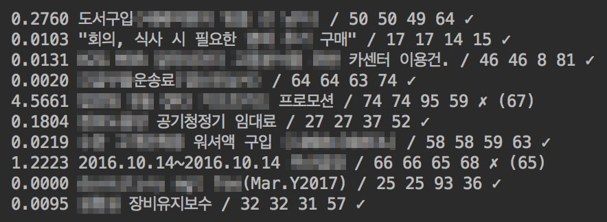

# which_account

Which account 는 TensorFlow로 구현된 계정 추천 프로그램 입니다.

## Prerequisites

- Python
- Tensorflow

## 사용 방법

### 1. 학습할 데이터 준비하기

학습할 데이터는 data 폴더 내의 train.txt 파일에 입력합니다.
        포맷은 "적요 텍스트" \t "계정숫자" 이며, 계정 숫자는 1부터 시작하는 정수로 입력합니다.

### 2. 모델 학습하기

프로그램을 실행합니다.
        python read_lstm.py

학습이 진행되면서 예측한 계정이 얼마나 맞는지 결과가 표시됩니다.
        certainty 적요 텍스트 / 실제 계정 / 예측한 계정 1,2,3 / 맞으면 v, 틀리면 x

